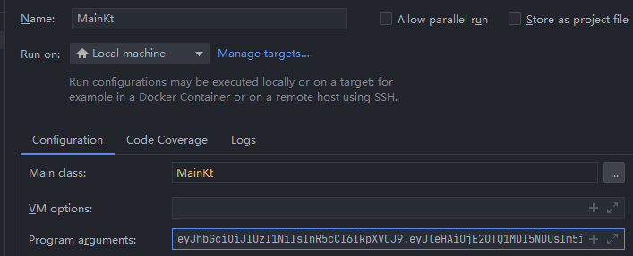

# LeaderSheep
## 一、这是什么

这是一款专为`羊了个羊`游戏编写的辅助程序，使用它可以帮助您快速通过任意关。比如，您可以设置一次性通关5次，同时，您还可以指定通关所用的时间，只需短短几秒钟便可通关完成。

## 二、前置条件

在使用本辅助程序前，您需要自行获取您在`羊了个羊`游戏中的Token，获取的方式是在电脑或手机上安装`抓包软件`，抓取`羊了个羊`小程序请求头中`key`为`t`的`value`。推荐使用`HTTP Debugger Pro`进行小程序包的抓取，如果您使用`Fiddler`，可能出现无法抓取微信小程序包的情况。具体的抓包方法，请自行查阅相关文章 。

## 三、如何使用

### 3.1、在IDEA中直接运行

您可以`clone`本项目，直接在IDEA中打开，在运行前，请一定记得配置`Program arguments`，内容为您抓取到的`t`对应的value，如果您不清楚在IDEA中如何配置`Program arguments`，可自行查阅相关文章 。

### 3.2、运行jar包

您可以直接下载jar包，使用命令`java -jar leader_sheep.jar t值`执行。示例：`java -jar leader_sheep.jar eyJhbGciOiJIUzI1NiIsInR5c...`。

## 四、更多配置

目前，程序并没有提供单独的配置文件，如果您需要自定义一些参数，需要您在代码中对常量值进行修改。后续将考虑读取配置文件的方式来配置这写个性化的参数值。目前可选择修改的常量名如下：

- `REQUEST_COUNT` 表示通关的次数
- `REQUEST_INTERVAL_TIME` 表示每次通关后，间隔多少毫秒再执行下一次通关
- `COMPLETE_TIME` 表示通关所用的时间，单位为秒
